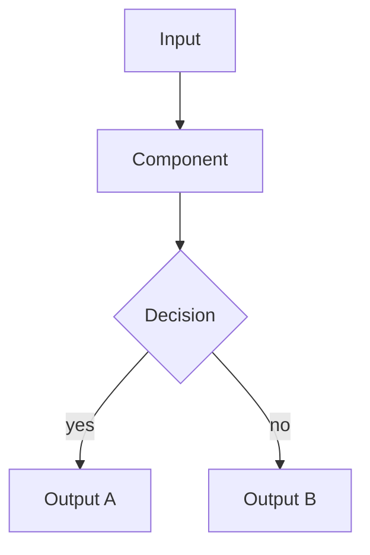
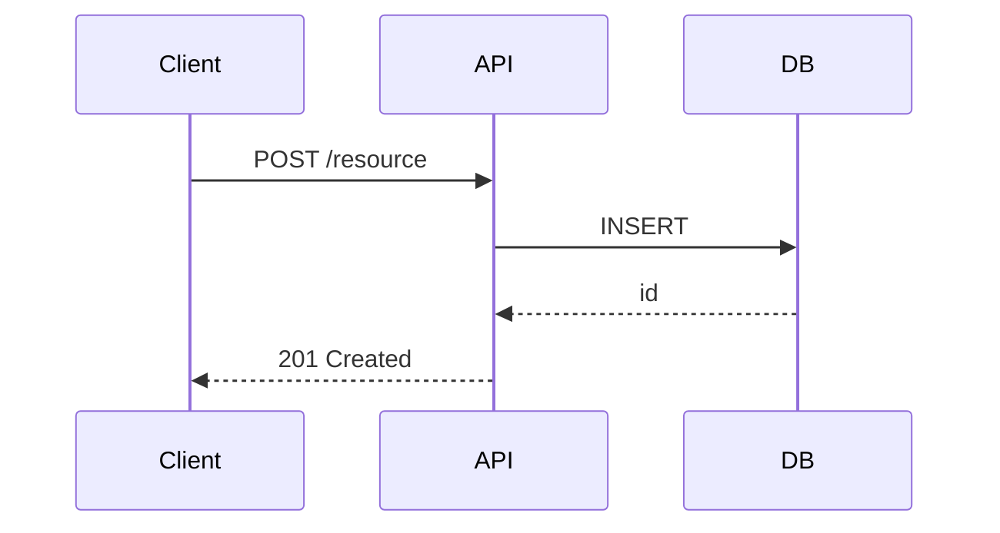

# ghdoc — Organization Documentation Standard

This skill encodes the organization-wide documentation standard for MkDocs + Material for MkDocs sites deployed to GitHub Pages. Use it when generating, reviewing, or modifying documentation sites.

## Quick Reference

**Stack**: MkDocs 1.6.x + Material for MkDocs 9.7.x + curated plugins
**Theme**: Material with light/dark toggle (auto-detected from OS preference)
**Fonts**: Inter (text) + JetBrains Mono (code)
**Build**: `mkdocs build --strict` in CI — zero warnings allowed
**Deploy**: `mkdocs gh-deploy --force` on push to main

## Unified Page Structure

Every repository's docs must contain these sections (adapt to what applies):

| Page | Purpose | Always? |
|---|---|---|
| `index.md` | Tagline, key features, quick-start snippet, nav links | Yes |
| `about.md` | Purpose, design goals, why it exists, alternatives comparison | Yes |
| `getting-started.md` | Zero-to-working in < 10 minutes | Yes |
| `use-cases/` | 2–5 real-world scenarios with full walkthroughs | Yes |
| `concepts/architecture.md` | System components, responsibilities, Mermaid diagram | If non-trivial |
| `concepts/data-flow.md` | How data moves through the system, sequence diagrams | If applicable |
| `reference/cli.md` | Every command, subcommand, flag, with examples | If CLI tool |
| `reference/api.md` | Every endpoint: method, path, request/response, auth | If REST API |
| `reference/configuration.md` | Every config key: type, default, env var, example | If configurable |
| `operations/deployment.md` | Install, Docker, k8s, production checklist | If deployable |
| `operations/monitoring.md` | Metrics, logs, health checks, alerts | If observable |
| `faq.md` | Top 10 questions with clear answers | Yes |
| `troubleshooting.md` | Error messages verbatim + fix steps | Yes |
| `changelog.md` | Version history (import from CHANGELOG.md if it exists) | Yes |
| `contributing.md` | How to contribute, dev setup, PR process | Yes |

## Page Content Requirements

### index.md
- Tagline in H1 (one sentence: what it does and for whom)
- 2-paragraph purpose (problem it solves, how it solves it)
- Feature grid or bullet list (4–8 key features)
- Quick-install snippet in a code block
- Nav cards or links to key sections

### about.md
- Detailed project purpose (not a repeat of README)
- Design philosophy (key trade-offs made)
- Comparison table vs. alternatives (if relevant)
- Known limitations
- Project status and roadmap (if public)

### getting-started.md
- Prerequisites checklist
- Install steps (tabbed by method: pip, docker, binary, etc.)
- Minimal working example (< 20 lines of real code)
- Expected output with a code block
- Link to next steps

### use-cases/*.md (one page per scenario)
- Scenario description (who is doing what, why)
- Full working example with realistic data
- Step-by-step walkthrough
- What to expect (output, side effects)
- Common variations
- Link to relevant reference pages

### reference/cli.md
- One H2 per top-level command
- Syntax line: `command subcommand [flags]`
- Table of flags: flag, type, default, description
- Collapsible examples block (`???` details) for each command
- Exit codes if non-standard

### reference/api.md
- One H2 per resource/group
- For each endpoint: `METHOD /path` as H3, description, auth requirements
- Request: headers, query params, body schema as code block
- Response: status codes, body schema, example response
- Tabbed examples (curl, Python, Go, etc.)

### reference/configuration.md
- Table per config section: key, type, default, env var, description
- Full example config file in a code block
- Notes on precedence (file vs. env vars vs. CLI flags)

## Baseline Plugin Set

Load `references/mkdocs-standard.md` for the full pinned configuration.

Baseline (every repo):
```
search, tags, privacy, git-revision-date-localized, git-authors, redirects, glightbox
```

Add if Python package: `mkdocstrings, mkdocstrings-python, autorefs`
Add if versioned releases: `mike`

## Color Scheme Options

See `references/color-schemes.md` for full palette configurations.

| Name | Primary | Accent | Personality |
|---|---|---|---|
| `indigo` (default) | indigo | blue | Professional, trustworthy |
| `teal` | teal | cyan | Modern, clean, technical |
| `blue-grey` | blue-grey | blue | Muted, sophisticated |
| `deep-purple` | deep purple | purple | Creative, bold |
| `orange` | orange | amber | Energetic, open-source |

## Mermaid Diagram Standards

Use flowchart TD for architecture overviews:


Use sequenceDiagram for data flow:


## Content Writing Rules

- Every code example must be copy-pasteable with real command/function names from the source.
- CLI flags must be verbatim from source code — never invented.
- Config keys must match actual config schemas exactly.
- Mark unknown content as `<!-- TODO: add <description> -->` — never invent facts.
- Use `!!! tip` for non-obvious best practices (at least one per page).
- Use `!!! warning` for known gotchas (at least one per page).
- Use `!!! note` for important context that isn't a warning.
- Use `???` (collapsible) for exhaustive parameter lists — show the 3 most common inline.
- Use tabbed content for OS-specific or method-specific variants.
- Add a `## Related pages` section at the bottom linking to 2–4 related pages.

## Additional Resources

- **`references/mkdocs-standard.md`** — full organization MkDocs standard with all plugin configs and CI workflow
- **`references/unified-structure.md`** — detailed content spec for each page type
- **`references/color-schemes.md`** — full Material palette configurations for each color scheme
- **`references/page-templates.md`** — ready-to-fill markdown templates for every page type
- **`examples/mkdocs.yml`** — complete mkdocs.yml with all options
- **`examples/requirements-docs.txt`** — pinned dependency list
- **`examples/docs-workflow.yml`** — GitHub Actions workflow for building and deploying
