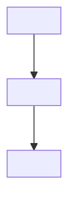

# Page Templates

Ready-to-fill markdown templates for each page type in the organization documentation standard.
Replace all `<PLACEHOLDER>` values with real content from the codebase analysis.
Remove or adapt any section that doesn't apply to the project.

---

## index.md

```markdown
---
tags:
  - home
  - overview
hide:
  - navigation
  - toc
---

# <PROJECT TAGLINE — one sentence: what it does and for whom>

<2–3 sentence elevator pitch: the problem this solves and how.>

<br>

[Get started](getting-started.md){ .md-button .md-button--primary }
[View on GitHub](<REPO_URL>){ .md-button }

---

## Features

- **<Feature 1>** — <one-line description>
- **<Feature 2>** — <one-line description>
- **<Feature 3>** — <one-line description>
- **<Feature 4>** — <one-line description>
- **<Feature 5>** — <one-line description>
- **<Feature 6>** — <one-line description>

---

## Quick install

=== "pip"
    ```bash
    pip install <package-name>
    ```

=== "Docker"
    ```bash
    docker pull <org>/<image>:<tag>
    ```

=== "Binary"
    ```bash
    curl -L <release-url> -o <binary-name> && chmod +x <binary-name>
    ```

---

## Minimal example

```<language>
<minimal working example — real code, < 20 lines, produces visible output>
```

---

## What's next?

<div class="grid cards" markdown>

- :material-rocket-launch: **[Getting started](getting-started.md)** — Up and running in minutes
- :material-lightbulb: **[Use cases](use-cases/index.md)** — Real-world examples
- :material-book-open: **[Reference](reference/cli.md)** — Complete command reference
- :material-cogs: **[Configuration](reference/configuration.md)** — All config options

</div>
```

---

## about.md

```markdown
---
tags:
  - about
  - overview
---

# About <PROJECT NAME>

## Why this exists

<The specific problem that motivated creation. What alternatives were tried and why they fell short.>

## Design principles

<PROJECT NAME> is built on these principles:

1. **<Principle>** — <explanation of the trade-off or goal>
2. **<Principle>** — <explanation>
3. **<Principle>** — <explanation>

## Architecture summary

<1-paragraph overview of the main components.>



See [Architecture](concepts/architecture.md) for a detailed breakdown.

## Comparison

| Feature | <PROJECT NAME> | <Alternative 1> | <Alternative 2> |
|---------|----------------|-----------------|-----------------|
| <Dimension> | ✅ Yes | ❌ No | ⚠️ Partial |
| <Dimension> | ✅ Yes | ✅ Yes | ❌ No |

## Known limitations

- <Limitation 1> — <context or workaround>
- <Limitation 2>

## Status

<Current stability: Alpha / Beta / Stable.> <Link to roadmap or changelog.>
```

---

## getting-started.md

```markdown
---
tags:
  - installation
  - quickstart
---

# Getting started

Get from zero to a working result in under 10 minutes.

## Prerequisites

- <Runtime/language> <version>
- <Other requirement>

!!! note "OS compatibility"
    Tested on Linux (Ubuntu 22.04+), macOS 13+, Windows 10+ (WSL2).

## Installation

=== "pip"
    ```bash
    pip install <package-name>
    ```

=== "Docker"
    ```bash
    docker pull <org>/<image>
    ```

=== "From source"
    ```bash
    git clone <repo-url>
    cd <repo-dir>
    pip install -e .
    ```

Verify the install:

```bash
<binary-name> --version
```

Expected output:
```
<binary-name> <version>
```

## First run

<Describe what this example does in one sentence.>

```<language>
<Complete minimal working example>
```

Expected output:
```
<Exact output the user will see>
```

!!! tip "What just happened"
    <3–4 sentences explaining each step of the first run.>

## Next steps

- [Use cases](use-cases/index.md) — see real-world examples
- [Configuration](reference/configuration.md) — tune the defaults
- [CLI reference](reference/cli.md) — all commands and flags
```

---

## use-cases/index.md

```markdown
---
tags:
  - use-cases
---

# Use cases

<PROJECT NAME> excels in these scenarios. Each page shows a complete working example
with step-by-step walkthrough.

<div class="grid cards" markdown>

- :material-<icon>: **[<Use case 1>](use-case-1.md)** — <one-line description>
- :material-<icon>: **[<Use case 2>](use-case-2.md)** — <one-line description>
- :material-<icon>: **[<Use case 3>](use-case-3.md)** — <one-line description>

</div>
```

---

## use-cases/<slug>.md

```markdown
---
tags:
  - use-cases
  - <relevant tag>
---

# <Use Case: Verb + Noun>

## Scenario

<Who is doing this (persona), what they need to accomplish, why this tool is the right choice for it.>

## Prerequisites

- <What must be configured or installed before this>

## Complete example

```<language>
<Full working code — not excerpts. This must run as-is.>
```

## Walkthrough

### Step 1: <Title>

<Explain lines X–Y of the example and why they matter.>

### Step 2: <Title>

<Explain the next important part.>

## Expected output

```
<Exact output or behavior the user should observe>
```

## Variations

### <Variation: e.g., with authentication>

```<language>
<Modified example>
```

### <Variation: e.g., at scale>

<Description and config changes>

## Related pages

- [Configuration reference](../reference/configuration.md)
- [Architecture](../concepts/architecture.md)
```

---

## faq.md

```markdown
---
tags:
  - faq
---

# FAQ

## How do I install <PROJECT NAME>?

See the [Getting started](getting-started.md) guide for full instructions.

The short version:

```bash
pip install <package-name>
```

## What's the difference between <PROJECT NAME> and <Alternative>?

<Concise comparison. Reference the about.md comparison table for details.>

## Does <PROJECT NAME> support <common assumption>?

<Direct yes/no answer with any important caveats.>

## How do I configure <most common scenario>?

```<yaml/json/bash>
<Configuration example>
```

See [Configuration reference](reference/configuration.md) for all options.

## What happens when <common failure>?

<Exact explanation. Reference troubleshooting.md for fixes.>

## How do I debug when nothing works?

1. Enable verbose logging: `<flag or config>`
2. Check the log output for `<key pattern>`
3. See [Troubleshooting](troubleshooting.md) for common errors.

## Is there a Docker image?

```bash
docker pull <org>/<image>:<tag>
```

See [Deployment](operations/deployment.md) for full Docker instructions.

## How do I contribute?

See [Contributing](contributing.md).

## What are the resource requirements?

| Component | CPU | Memory | Disk |
|-----------|-----|--------|------|
| <component> | <req> | <req> | <req> |

## Where can I get help?

- [GitHub Issues](<repo-url>/issues)
- [Discussions](<repo-url>/discussions)
```

---

## troubleshooting.md

```markdown
---
tags:
  - troubleshooting
  - debugging
---

# Troubleshooting

!!! tip "Before diving in"
    Enable verbose logging with `<flag>` to get more detail in error messages.

## Common errors

### Error: `<exact error message from source>`

**Cause**: <What triggers this error.>

**Fix**:

```bash
<Command or config change that resolves it>
```

!!! warning "Check <something>"
    <Any non-obvious prerequisite to check.>

---

### Error: `<another common error>`

**Cause**: <Explanation.>

**Fix**: <Steps to resolve.>

---

## Diagnostic steps

When something is wrong and you don't have a specific error message:

1. Check the version: `<binary> --version`
2. Enable debug logging: `<flag or config>`
3. Check connectivity: `<command>`
4. Review config: `<command or file path>`

## Still broken?

[Open an issue](<repo-url>/issues/new) and include:

- Output of `<binary> --version`
- The full error message and stack trace
- Your configuration (redact secrets)
- Steps to reproduce
```

---

## contributing.md

```markdown
---
tags:
  - contributing
  - development
---

# Contributing

Contributions welcome — issues, docs, tests, and code.

## Setup

```bash
git clone <repo-url>
cd <repo-dir>
<install dev dependencies>
<run tests>
```

## Code standards

```bash
<lint command>
<format command>
<type-check command>
```

All three must pass before submitting a PR.

## Tests

```bash
<run tests command>
```

Coverage must stay above 80%.

## Pull request process

1. Fork the repo and create a branch: `feature/<description>` or `fix/<description>`.
2. Make your changes. Add tests for new behavior.
3. Ensure all checks pass.
4. Open a PR against `main` with a clear description of what changed and why.

## Commit messages

Use imperative mood: `Add feature` not `Added feature`.
Reference issues: `Fix #123` or `Closes #456`.
```
